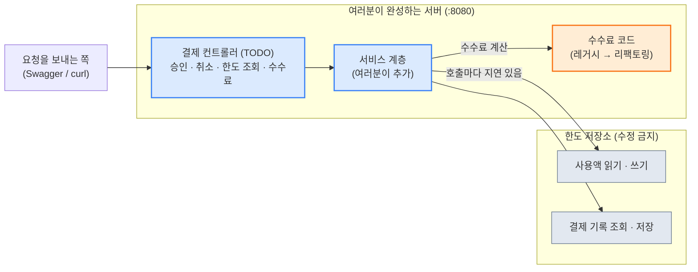

# 결제 한도 차감 + 수수료 정책

> 백엔드 실습 과제 · 상태: **문서 확정 v1.2** (2026-09-28) · 뼈대 프로젝트·정답 서버로 모든 시나리오·수수료 규칙 실제 검증 완료

> [!IMPORTANT]
> 이 문서를 **처음부터 끝까지** 읽고 시작하세요. **경로, 요청·응답 형식, 규칙 표는 그대로 지켜야** 하고, 그 안의 구현 방법은 스스로 결정합니다.

> [!TIP]
> 📄 **처음이라 막막하다면 [`docs/requirements-overview.pdf`](docs/requirements-overview.pdf)부터 열어보세요.** 그림 위주로 큰 그림과 핵심 함정을 3페이지로 정리한 요약본입니다. 자세한 규격은 이 README가 기준입니다.

## 한눈에 보기

| | |
|---|---|
| 🎯 **보는 능력** | 정확성과 설명 — 동시 요청에서도 틀리지 않고, 왜 그런지 설명할 수 있는가 |
| 🧩 **만드는 것** | 결제 컨트롤러 완성 + 수수료 정책 리팩토링 (Java 17 · Spring Boot 4.1.1 · Gradle, DB 없음) |
| 📦 **제공되는 것** | `TODO`가 있는 뼈대 프로젝트, 수정 금지 한도 저장소, 서술 템플릿 |
| ⏱️ **제한 시간** | 없음 |
| ⚠️ **핵심 난제** | 한도 저장소가 일부러 느립니다 — "확인하고 실행"하는 사이에 다른 요청이 끼어듭니다 |

## 목차

- [이 폴더에는 무엇이 있나](#이-폴더에는-무엇이-있나)
- [1. 과제 소개](#1-과제-소개)
- [2. 여러분이 하는 것과 제공되는 것](#2-여러분이-하는-것과-제공되는-것)
- [3. 시작하기](#3-시작하기)
- [4. 알아야 할 용어](#4-알아야-할-용어)
- [5. 약속 1 — API](#5-약속-1--api)
- [6. 약속 2 — 수수료 정책](#6-약속-2--수수료-정책)
- [7. 문제 (6개)](#7-문제-6개)
- [8. 시나리오 체크리스트](#8-시나리오-체크리스트)
- [9. 서술 템플릿](#9-서술-템플릿)
- [10. 제출](#10-제출)
- [11. 평가 안내](#11-평가-안내)
- [12. 막혔을 때 (힌트)](#12-막혔을-때-힌트)

---

## 이 폴더에는 무엇이 있나

| 파일·폴더 | 용도 |
|---|---|
| `README.md` (이 문서) | 과제 설명, 약속, 문제, 시나리오, 힌트 — 전부 여기 있습니다 |
| [`docs/requirements-overview.pdf`](docs/requirements-overview.pdf) | **처음 보시는 분들을 위한 요약본** (3페이지, 그림 위주) |
| `starter-project/` | **여기서 시작하세요.** `TODO`가 있는 결제 컨트롤러, 수정 금지 저장소, 리팩토링 대상 수수료 코드가 들어 있습니다 |
| `docs-template/answer.md` | 서술 템플릿. 복사해서 `starter-project/docs/answer.md`로 채우세요 |
| `requests.http` | IntelliJ HTTP Client용 요청 예시 (시나리오 확인용) |

## 1. 과제 소개

카드 결제 서버가 있습니다. 사용자마다 **1,000,000원의 한도**가 있고, 결제가 승인되면 한도가 줄어듭니다. 취소하면 한도가 돌아옵니다. 결제마다 **수수료**도 계산합니다.

문제는 **요청이 동시에 몰릴 때**입니다. 같은 결제가 두 번 승인되거나, 동시에 들어온 결제들 때문에 한도를 넘어서거나, 사용액이 실제와 어긋나면 안 됩니다. 돈이 걸린 로직은 틀리면 안 됩니다.

> [!TIP]
> **이 과제에서 보는 능력: 정확성과 설명.**
> - 동시에 요청이 와도 **정확하게** 동작하게 만들기
> - 규칙 표를 **경계값까지 정확히** 구현하기
> - 내가 만든 것이 맞다는 것을 **테스트로 증명**하기
> - 왜 그렇게 만들었는지 **글로 설명**하기

## 2. 여러분이 하는 것과 제공되는 것

| | 내용 |
|---|---|
| **제공되는 것** | 뼈대 프로젝트 (`TODO`가 있는 결제 컨트롤러, 수정 금지 한도 저장소, 기존 수수료 코드, 빈 테스트 틀), 이 가이드, 서술 템플릿 |
| **여러분이 하는 것** | `TODO` 구현, 수수료 정책 재작성, **테스트 작성**, **서술 작성** |
| 스택 | Java 17, Spring Boot 4.1.1, Gradle (JPA와 DB는 쓰지 않습니다) |
| 제한 | 서버는 1대라고 가정, 외부 서비스 없음 |
| 제한 시간 | 없음 |

> [!IMPORTANT]
> **수정하면 안 되는 것**: 한도 저장소, 결제 기록 클래스, 경로와 요청·응답 형식, 설정 파일. 나머지는 자유롭게 클래스를 추가해도 됩니다.

다음은 여러분이 만드는 서버 안에서 요청이 흘러가는 구조입니다. **파란색은 여러분이 구현하는 부분, 주황색은 리팩토링 대상, 회색은 수정 금지 영역**입니다.



## 3. 시작하기

1. `starter-project/`를 IntelliJ에서 엽니다.
2. 서버를 실행합니다.
   ```bash
   ./gradlew bootRun
   ```
   서버는 `8080` 포트에서 실행됩니다.
3. 테스트를 실행합니다.
   ```bash
   ./gradlew test
   ```
4. Docker나 다른 서버는 필요 없습니다.

## 4. 알아야 할 용어

| 용어 | 뜻 |
|---|---|
| **동시성 문제 (경합)** | 여러 요청이 같은 데이터를 동시에 건드릴 때 결과가 어긋나는 문제 |
| **확인 후 실행 (check-then-act)** | "한도가 남았나 확인하고, 남았으면 차감"처럼 확인과 실행 사이에 다른 요청이 끼어들 수 있는 패턴 |
| **락 (잠금)** | 한 번에 한 요청만 특정 구간을 실행하게 하는 장치. 잠그는 **범위**가 중요함 |
| **불변 조건** | 언제나 참이어야 하는 규칙. 이 과제에서는 `사용액 = 취소되지 않은 승인 결제 금액의 합` |
| **경계값** | 규칙이 바뀌는 값과 그 앞뒤 (예: 999원과 1,000원) |
| **절사** | 소수점 이하를 버림 (반올림과 다름) |
| **리팩토링** | 동작은 같게 두고 코드를 읽기 쉽게 정리하는 것 |

---

## 5. 약속 1 — API

### 5-1. 결제 승인

`POST /api/v1/payments`

```json
{ "paymentId": "P-1001", "userId": "U-1", "amount": 50000, "grade": "GOLD", "payType": "DOMESTIC" }
```

| 필드 | 규칙 |
|---|---|
| `paymentId` | 결제 ID. 필수, 1~50자. **전체 사용자에서 유일**합니다 |
| `userId` | 사용자 ID. 필수, 1~50자 |
| `amount` | 결제 금액(원). 정수, **1 이상 100,000,000 이하** |
| `grade` | `BASIC`, `SILVER`, `GOLD`, `VIP` 중 하나 |
| `payType` | `DOMESTIC`(국내), `OVERSEAS`(해외) 중 하나 |

**응답**

| 상황 | 상태 코드 | 본문 |
|---|---|---|
| 승인 | **200** | `{"paymentId":"P-1001","userId":"U-1","amount":50000,"fee":250,"status":"APPROVED","remainingLimit":950000}` |
| 입력 오류 | **400** | 에러 본문 (`INVALID_REQUEST`) |
| 이미 있는 결제 ID | **409** | 에러 본문 (`DUPLICATE_PAYMENT`) |
| 한도 초과 | **422** | 에러 본문 (`LIMIT_EXCEEDED`) |

**에러 본문 (공통)**

```json
{ "code": "LIMIT_EXCEEDED", "message": "한도를 초과했습니다.", "paymentId": "P-1001" }
```

**검사 순서**: ① 입력 검증(400) → ② 결제 ID 중복(409) → ③ 한도(422) → ④ 승인(200)

### 5-2. 결제 취소

`POST /api/v1/payments/{paymentId}/cancel`

| 상황 | 상태 코드 | 본문 |
|---|---|---|
| 취소 성공 | **200** | `{"paymentId":"P-1001","status":"CANCELED","restoredAmount":50000,"remainingLimit":1000000}` |
| 없는 결제 | **404** | 에러 본문 (`PAYMENT_NOT_FOUND`) |
| 이미 취소됨 | **409** | 에러 본문 (`ALREADY_CANCELED`) |

### 5-3. 한도 조회

`GET /api/v1/users/{userId}/limit`

```json
{ "userId": "U-1", "dailyLimit": 1000000, "usedAmount": 50000, "remainingLimit": 950000 }
```

처음 보는 사용자는 `usedAmount`가 0입니다.

### 5-4. 수수료 계산

`GET /api/v1/fees?grade=GOLD&payType=DOMESTIC&amount=50000`

```json
{ "grade": "GOLD", "payType": "DOMESTIC", "amount": 50000, "fee": 250 }
```

입력이 잘못되면 400입니다. 승인 API의 `fee`와 같은 값이어야 합니다.

### 5-5. 한도와 결제 기록의 규칙

| 규칙 | 내용 |
|---|---|
| 사용자당 한도 | **1,000,000원** (날짜별 초기화는 다루지 않습니다) |
| 한도 차감액 | **결제 금액(`amount`)**. **수수료는 한도에 포함하지 않습니다** |
| 승인 조건 | `사용액 + 이번 금액 ≤ 1,000,000` |
| 취소 | 사용액에서 해당 결제 금액을 뺍니다 |
| 승인된 결제 | 기록이 **영구히 남습니다.** 취소한 결제의 ID도 **다시 쓸 수 없습니다** (409) |
| 거절된(422) 결제 | **기록하지 않습니다.** 같은 ID로 다시 요청할 수 있습니다 |
| 항상 지켜야 할 것 | `사용액 = 취소되지 않은 승인 결제 금액의 합`, `사용액 ≤ 1,000,000` |

---

## 6. 약속 2 — 수수료 정책

수수료율은 **bp**(1bp = 0.01%)로 생각하면 정수로 계산할 수 있습니다. (예: 1.00% = 100bp)

| # | 규칙 |
|---|---|
| R1 | 금액이 **1,000원 미만**이면 수수료 **0원** (면제) |
| R2 | 등급이 **VIP**이고 **국내** 결제이면 수수료 **0원** (면제) |
| R3 | 기본 수수료율: 국내 **1.00%**, 해외 **3.00%** |
| R4 | **SILVER**는 기본율의 **80%** |
| R5 | **GOLD**는 기본율의 **50%** |
| R6 | **VIP** 해외 결제는 **1.50%** (기본율과 무관) |
| R7 | **BASIC**은 기본율 그대로 |
| R8 | 금액이 **1,000,000원 이상**이면 적용된 수수료율에서 **0.20%p 차감** |
| R9 | 수수료는 `금액 × 수수료율`을 **원 단위 미만 절사**하고, **면제가 아니면 최소 100원** |
| R10 | 수수료는 **최대 50,000원** |

**적용 순서**: ① 면제(R1 → R2) → ② 수수료율 결정(R3~R7) → ③ 고액 감면(R8) → ④ 절사와 최소(R9) → ⑤ 상한(R10)

**계산 예시**

| 금액 | 등급 | 유형 | 수수료 | 설명 |
|---|---|---|---|---|
| 999 | BASIC | 국내 | 0 | 1,000원 미만이라 면제 (R1) |
| 1,000 | BASIC | 국내 | 100 | 계산하면 10원이지만 최소 100원 |
| 12,350 | BASIC | 국내 | 123 | 123.5원에서 절사 |
| 999,999 | BASIC | 국내 | 9,999 | 고액 감면 대상이 아님 |
| 1,000,000 | BASIC | 국내 | 8,000 | 고액 감면 적용 (0.80%) |
| 5,000,000 | VIP | 국내 | 0 | 면제(R2)가 우선 |
| 10,000,000 | BASIC | 해외 | 50,000 | 계산하면 28만 원이지만 상한 |

> [!WARNING]
> 뼈대에 들어 있는 **기존 수수료 코드는 이 표와 다른 부분이 있습니다.** 기존 코드를 믿지 말고 **이 표를 기준**으로 구현하세요.

---

## 7. 문제 (6개)

문제는 **1번부터 순서대로** 푸는 것을 권장합니다. 제한 시간은 없습니다. 모든 문제를 풀어서 제출하세요.

### 문제 1. 결제 승인·취소·한도 조회를 구현하세요 (구현)

- 결제 컨트롤러의 `TODO`를 구현합니다. 위 5장의 규칙을 모두 지켜야 합니다.
- **동시에 요청이 와도** 다음이 지켜져야 합니다.
  - 같은 결제 ID는 **1건만 승인**되고 나머지는 409 (다른 사용자가 같은 ID로 요청해도 마찬가지)
  - 같은 사용자의 서로 다른 결제가 동시에 와도 **한도를 넘지 않고, 사용액이 정확**해야 함
  - 같은 결제의 취소가 동시에 여러 번 와도 **한도는 한 번만 복원**
- 한도 저장소는 **수정할 수 없고**, 호출마다 시간이 걸립니다. 저장소 밖(서비스 코드)에서 안전하게 처리하세요.

### 문제 2. 동시성을 검증하는 테스트를 작성하세요 (테스트)

- 문제 1의 동시성 규칙이 **정말 지켜지는지 스스로 증명**하는 테스트를 작성합니다. 검증 방법은 자유입니다.
- 좋은 테스트는 다음을 보여 줍니다.
  - 요청을 **실제로 동시에** 보낸다 (스레드, 래치 등)
  - 결과의 **개수**(정확히 1건만 성공)와 **최종 사용액**을 확인한다
  - 실행할 때마다 같은 결과가 나온다 (테스트 사이에 저장소를 초기화)

### 문제 3. 수수료 정책을 구현하고 리팩토링하세요 (구현)

- 6장의 규칙 표대로 수수료를 계산합니다. 기존 코드를 고쳐도 되고 새로 만들어도 됩니다.
- **결과가 표와 같아야** 하고, 규칙이 **읽기 쉽게 정리**되어야 합니다.
- 승인 API의 `fee`와 수수료 계산 API의 `fee`가 같아야 합니다.

### 문제 4. 수수료 정책을 검증하는 테스트를 작성하세요 (테스트)

- 규칙이 바뀌는 지점(**경계값**)과 규칙끼리 겹치는 경우를 확인하는 테스트를 작성합니다.
- 예: 999원과 1,000원, 999,999원과 1,000,000원, 최소·최대 수수료, 등급별 차이

### 문제 5. 풀이 이유를 설명하세요 (서술)

- 문제 1~4를 **왜 그렇게 풀었는지** 설명합니다. 어떤 방법을 선택했고, **다른 선택지 대신 왜 그것을 골랐는지**를 적으세요.

### 문제 6. 이번 과제에서 가장 어려웠던 문제를 설명하세요 (서술)

- 이번 과제에서 **가장 어려웠던 문제 하나**를 골라, 아래 흐름으로 적습니다.
  - **문제 상황**: 어떤 문제였는지
  - **원인 파악과 해결 과정**: 어떻게 원인을 찾고 어떻게 해결했는지
  - **결과와 배운 점**: 어떤 결과를 얻었고 무엇을 배웠는지

---

## 8. 시나리오 체크리스트

아래 시나리오가 모두 기대대로 동작해야 합니다.

| # | 시나리오 | 기대 결과 |
|---|---|---|
| S1 | 정상 승인 | 200, 수수료와 잔여 한도가 정확함 |
| S2 | 같은 결제 ID로 (순차) 다시 승인 요청 | 409 `DUPLICATE_PAYMENT`. 한도는 한 번만 차감 |
| S3 | 같은 결제 ID(같은 사용자) 요청이 **동시에** 여러 건 | **정확히 1건만 200**, 나머지 409. 사용액은 1건분 |
| S4 | 같은 결제 ID를 **서로 다른 사용자**가 동시에 요청 | **정확히 1건만 200** |
| S5 | 같은 사용자의 **서로 다른 결제가 동시에** 한도를 넘는 합으로 요청 | 한도 안에서만 승인, 나머지 422. 사용액이 정확함 |
| S6 | 한도 경계 | 정확히 1,000,000원까지 승인, 1원 초과는 422. 거절된 ID로 나중에 다시 요청 가능 |
| S7 | 입력 오류 | 400 (승인 API, 수수료 API) |
| S8 | 승인된 결제 취소 / 없는 결제 취소 | 200과 한도 복원 / 404 |
| S9 | **같은 결제의 취소**가 동시에 여러 건 | **정확히 1건만 200**, 나머지 409. 한도는 한 번만 복원 |
| S10 | 취소한 결제 ID로 다시 승인 | 409. 한도 그대로 |
| S11 | **승인과 취소가 섞여** 동시에 | 어느 순서든 최종 사용액 = 취소되지 않은 승인 결제 금액의 합 |
| S12 | 수수료 규칙 (경계값 포함) | 모든 입력에서 표와 같은 수수료 |

> 예) S5: 한도 1,000,000원인 사용자에게 400,000원짜리 결제 3건이 서로 다른 ID로 동시에 오면, **2건 승인, 1건 거절**이고 사용액은 800,000원이어야 합니다.

---

## 9. 서술 템플릿

`docs/answer.md`에 아래 **제목을 그대로** 사용해서 작성합니다.

```markdown
# 서술

## 문제 5. 풀이 이유

### 5-1. 동시성 처리 방식과 이유
(어떤 방법으로 막았는지, 락의 범위는 어디까지인지, 다른 방법 대신 이것을 고른 이유)

### 5-2. 수수료 정책 구현 방식과 이유
(규칙을 어떻게 구조화했는지, 적용 순서를 어떻게 지켰는지, 그렇게 한 이유)

### 5-3. 테스트 설계와 이유
(무엇을 어떻게 검증했는지, 왜 그 테스트가 충분하다고 생각하는지)

### 5-4. 중요하게 생각한 점

## 문제 6. 가장 어려웠던 문제

### 6-1. 문제 상황

### 6-2. 원인 파악과 해결 과정

### 6-3. 결과와 배운 점
```

## 10. 제출

| 항목 | 규칙 |
|---|---|
| 구조 | 뼈대 프로젝트에서 이어서 작업. 루트에 `README.md`, `docs/answer.md` |
| 실행 | 루트에서 `./gradlew bootRun`, 포트 **8080** |
| 테스트 | 루트에서 `./gradlew test`가 **통과**해야 합니다 |
| 수정 금지 | 한도 저장소, 결제 기록 클래스, 경로와 형식, 설정 파일을 바꾸지 않습니다 |
| README | 실행 방법과 확인한 시나리오 |

## 11. 평가 안내

| 영역 | 배점 | 내용 |
|---|---|---|
| A. 정확성 | 40 | 동시성·중복·한도 시나리오(20), 수수료 규칙(20) |
| B. 테스트 작성 | 25 | 동시성 테스트, 경계값 테스트, 재현성 |
| C. 서술 | 20 | 풀이 근거, 어려웠던 문제의 설명 |
| D. 코드·리팩토링 | 15 | 규칙 정리, 구조, 에러 응답, 수정 금지 준수 |

> [!WARNING]
> **이렇게 하면 크게 감점됩니다**
> - 한도를 넘는 승인, 또는 같은 결제 ID가 두 번 승인됨
> - 서버가 실행되지 않거나 테스트가 통과하지 않음

## 12. 막혔을 때 (힌트)

막혔을 때 **하나씩만** 열어 보세요.

<details>
<summary><b>힌트 1: 어디가 문제인가</b></summary>
<br>

"사용액을 읽는다 → 한도를 확인한다 → 사용액을 쓴다"는 세 단계 사이에 다른 요청이 끼어들 수 있습니다. 저장소가 일부러 느리기 때문에 이 틈이 크게 벌어집니다.

</details>

<details>
<summary><b>힌트 2: 락의 범위</b></summary>
<br>

무엇을 기준으로 잠가야 서로 다른 사용자의 결제는 동시에 처리되면서도 같은 사용자의 결제는 안전할까요? 그리고 **다른 사용자가 같은 결제 ID**를 보내면 그 락으로 충분할까요?

</details>

<details>
<summary><b>힌트 3: 결제 ID 중복</b></summary>
<br>

"이미 있는지 확인하고 저장"은 동시에 오면 둘 다 없다고 볼 수 있습니다. **기록하기 전에 먼저 ID를 차지**하는 방법을 생각해 보세요. 한도 초과로 거절되면 그 ID를 놓아 주어야 합니다.

</details>

<details>
<summary><b>힌트 4: 수수료</b></summary>
<br>

규칙을 조건문 하나에 몰아넣지 말고, **적용 순서대로 단계**를 나눠 보세요. 소수 대신 **정수(bp)**로 계산하면 오차가 없습니다. 절사와 반올림은 결과가 다릅니다.

</details>

<details>
<summary><b>힌트 5: 테스트</b></summary>
<br>

동시성 테스트는 요청을 **한 번에 출발**시켜야 의미가 있습니다. 성공한 개수, 실패한 개수, 그리고 마지막에 한도 조회로 사용액을 확인하세요.

</details>
